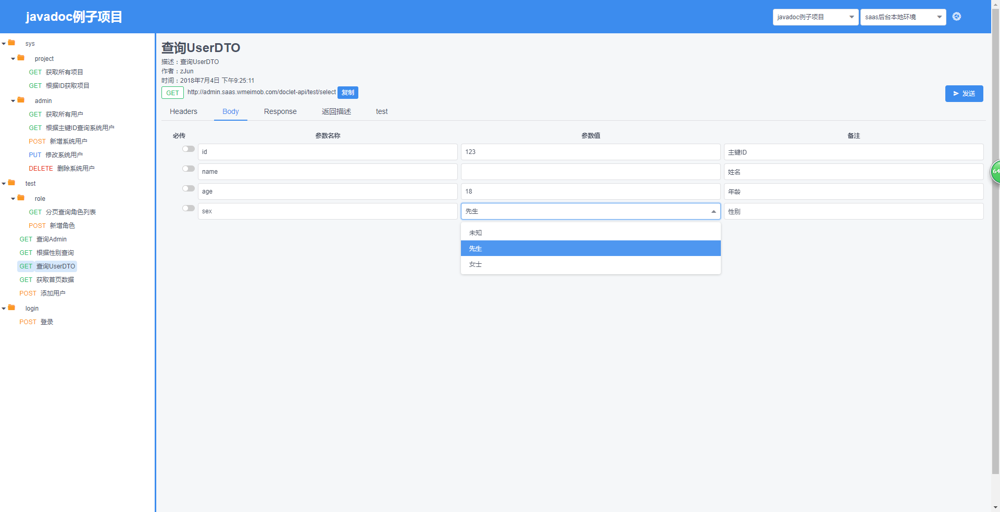
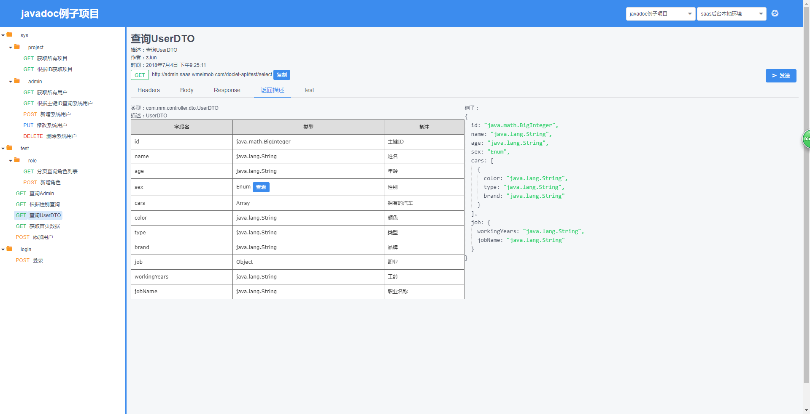
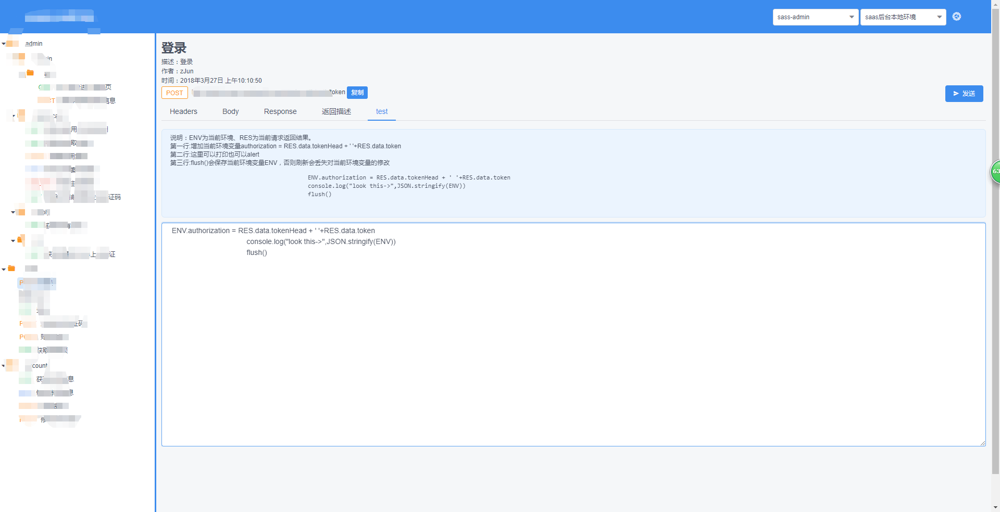

## 根据javadoc注释生成前端调用接口文档
### 希望有人能给我点修改意见
# 自定义注释
## @header 参数名 备注
需与注解@RequestMapping结合使用，也就是说如果接口必需包含指定的头部header注解必需添加headers属性

## @param 参数名 备注 默认值 是否必需
    
```
/**
 * 登录
 * @param username 登录账号 410919244
 * @param password 登录密码 123456
 * @return Token
 * @author zJun
 * @date 2018年3月27日 上午10:10:50
 */
@PostMapping("token")
public ResponseEntity<Token> auth(String username, String password) {
    return ResponseEntity.ok(token);
}
```


必需和参数对应，参数可以是对象。除参数名其它都可为空，建议至少加上备注。默认值只是为了方便测试调用接口用的

## @choice 选中属性 空格分隔
	
```
/**
 * 新增系统用户
 * @param user
 * @choice fullName account password
 * @return 返回新增后系统用户ID
 * @author zJun
 * @date 2018年7月3日 下午4:44:16q
 */
@PostMapping
public BigInteger add(AdminUser user) {
	checkAuth();
	user.setGmtCreate(new Date());
	user.setGmtModified(new Date());
	iAdminUserDao.save(user);
	return user.getId(); 
}
```

当参数是对象时使用，表示该接口只需要fullName、account、password三个参数

## @exclude 排除属性 空格分割
	
```
/**
 * 查询UserDTO
 * @param dto 测试
 * @exclude cars job
 * @return UserDTO
 * @author zJun
 * @date 2018年7月4日 下午9:25:11
 */
@GetMapping("select")
public UserDTO select(UserDTO dto) {
	return new UserDTO();
}
```

当参数是对象时使用，表示该接口排除的字段

## @default 默认值 可加在类属性上
    
```
/**
 * 性别
 * @default SIR
 */
private Sex sex;
```

在类中字段上使用，测试接口时会默认给input赋值，Sex为枚举类型

## @contextPath 加在类注释上（单独生成某个模块或者项目可在全局类中指定）
    
```
/**
 * 应用管理
 * @contextPath /admin-sass
 * @author zJun
 * @date 2018年4月26日 下午7:02:23
 */
```

## @see 由于时间问题没写逻辑

在Controller类上使用，指定请求上下文。如果生成的文档是单个项目可指定全局contextPat。该注释在同时生成多个模块(maven模块开发)时使用

# 注解使用规范
## 当接口不需要指定header时
    
```
@PostMapping("refresh")
```


## 当接口需要指定header参数token时
   
```
@PostMapping(value="refresh", headers= {"token"})
```

    
路径使用value属性，不要使用name属性

# 在Controller类上使用
   
```
@RequestMapping(value="/admin/weixin/api", headers= {"token"})
```

表示该类下的所有接口头部header必需包含token


# 使用说明


## pom.xml

```
<dependency>
	<groupId>com.wmeimob</groupId>
	<artifactId>wmeimob-doclet</artifactId>
	<type>jar</type>
</dependency>
```

## java代码
```
package com.mm;


import com.mm.doclet.ControllerDoclet;
import com.mm.doclet.Main;
import com.mm.entity.SingletonDocs;
import com.mm.entity.SingletonModule;

// 该文件在wmeimob-doclet-example项目中，大家可以去试试
public class Doclet {

	public static void main(String[] args) {
		SingletonDocs instance = SingletonDocs.getInstance();
		// 全局的上下文contextPath配置
		instance.setContextPath("/doclet-api");
		// 您要加载的包路径
		String subpackages = "com.mm";
		// 项目路径；您java代码的路径
		String path = "E:\\word\\2018.5.8\\wmeimob\\wmeimob-doclet-example\\";
		// 加载代码，可多次加载。也就是说能加载多个目录的代码，maven分模块会用到
		// Main.go(path, subpackages);
		path = "E:\\word\\2018.5.8\\wmeimob\\wmeimob-doclet-example\\";
		Main.go(path, subpackages);
		// 开始解析生成JSON
		ControllerDoclet.execute();
		// 输出JSON到控制台、怎么用您自己决定。在这个项目中是复制起来保存到node/html/static/文件名.json中
		System.out.println(SingletonModule.getInstance().datoToJSONString());
	}

}

```

## 前端说明

1. 目录: node/html/ 编译后的文件
2. 目录: node/javadoc/ 前端源码
3. 原本打算将数据存数据库，因赶时间部分存本地缓存了，项目文档JSON存为文件.json放在static目录
4. static目录下project.json存的是项目列表。title为网页显示的项目名，name为项目文件名（不加.json）
5. 例如:{title:'A', name:'test'} 项目展示名称为[A]，选择后会加载[test.json]文件 test.json内容为wmeimob-doclet生成的JSON


## 前端nginx部署配置
[nginx下载地址](http://nginx.org/en/download.html)

如果您的项目接口允许跨域访问，您可以随意配置。否则请将下面配置与测试接口域名一致。

您可以设置虚拟域名host定向到本地，通过下面配置访问到前端页面。增加您接口的配置通过域名上下文转发到您的项目

```
    location /doclet {
	    try_files $uri $uri/ /doclet/index_prod.html;
	    root   d:/web/node/html/;
	    index  index_prod.html index.htm;
	}

	location /static {
	    root   d:/web/node/html/;
	    index  index_prod.html index.htm;
	}
	
	# test为您项目的上下文，8090：您项目的端口
	location /test {
		proxy_pass    http://127.0.0.1:8090/test;
	}
```


# 效果展示

- 请求参数
    
- 返回说明
    
- 环境变量
    


### 注意不要使用循环属性，否则会出现死循环。
比如 A类中有一个属性是A类型。或者A中有B，B中有A这样

## 有事扫码
- 支付宝
    
    

- 微信
    
    

- 发红包
    
    